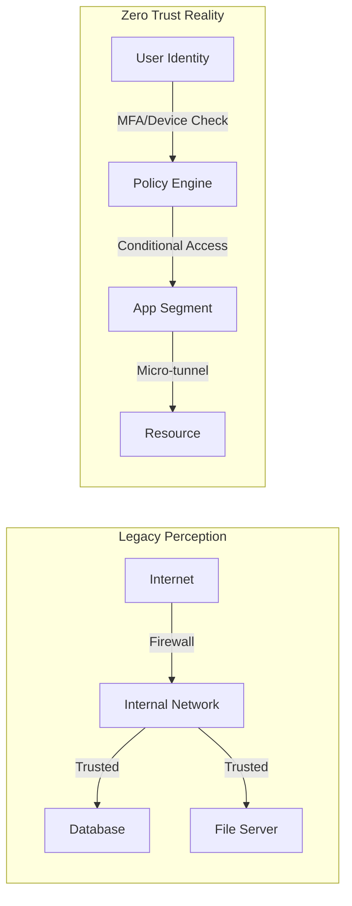

# Network Security

Moving beyond the "Hard Outer Shell, Soft Chewy Center" model.

## 1. Zero Trust Architecture (ZTA)
Traditional security trusted everything inside the VPN. ZTA trusts nothing.

- **Core Principles**:
  1.  **Verify Explicitly**: Authenticate and authorize based on all available data points (User identity, location, device health, data classification).
  2.  **Use Least Privilege Access**: Limit user access with Just-In-Time and Just-Enough-Access (JIT/JEA).
  3.  **Assume Breach**: Segment access by network, user, devices, and app awareness.

## 2. Micro-segmentation & Firewall Rules
Instead of one flat network (10.0.0.0/8), every workload is isolated.

### Example: Firewall Policy (Palo Alto Style)
| Rule Name | Source Zone | Source Addr | Dest Zone | Dest Addr | App/Service | Action | Profile |
| :--- | :--- | :--- | :--- | :--- | :--- | :--- | :--- |
| **Block-Bad-IPs** | Wan | EDL-Malicious-IPs | Any | Any | Any | Drop | Log-High |
| **Allow-Web-Out** | Trust-User | 10.10.50.0/24 | Wan | Any | web-browsing, ssl | Allow | AV-IPS-URL |
| **Allow-DMZ-SQL** | DMZ-Web | 172.16.10.5 | Data-Center | 10.50.10.10 | ms-sql-s | Allow | Strict-IPS |
| **Cleanup-Rule** | Any | Any | Any | Any | Any | Drop | Log-All |

- **East-West Control**: Preventing lateral movement. If the Web Server (DMZ) is compromised, it should ONLY be able to talk to the SQL Server on port 1433, not RDP into the Domain Controller.

## 3. Next-Generation Firewalls (NGFW)
Packet filtering (L3/L4) is dead. You need L7 visibility.
- **App-ID**: Identifying traffic as "Skype" or "BitTorrent" regardless of port (e.g., blocking SSH running on port 443).
- **User-ID**: Linking IP addresses to Active Directory users. "Bob in HR can access Facebook, but Alice in Finance cannot."
- **SSL Decryption**: Inspecting encrypted traffic.
  > [!IMPORTANT]
  > **90%+ of modern malware uses encrypted channels (HTTPS)**. If you are not decrypting SSL at the gateway, you are blind to the payload.
