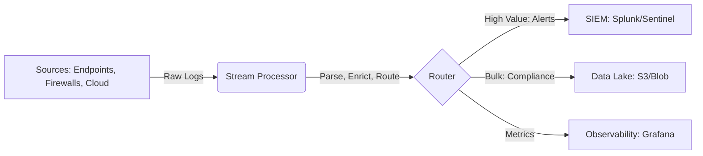

# Modern Data Pipeline & Strategy

Stop paying the "Splunk Tax" for low-value logs.

## 1. The Broken Model (Dump & Pray)
Traditionally, orgs installed Forwarders on every server and dumped **everything** into a SIEM (Splunk/Sentinel).
- **Problem**: 90% of logs (Verbose Windows Events, Debug logs) are never queried but cost millions to store.
- **Latency**: Searching petabytes of data is slow.

## 2. The Solution: Data Pipelines (Cribl Stream / OCSF)
Using a stream processor (like **Cribl Stream** or **Vector**) *before* the data hits the SIEM.



### A. Routing & Forking
- **High Value (Alerts)**: Route directly to SIEM (Splunk) for immediate Triage.
- **Compliance (Bulk)**: Route to cheap object storage (AWS S3 / Azure Blob) aka **Data Lake**.
  - *Result*: Massive cost reduction. SIEM is fast and lean; data lake is cheap and deep.

### B. In-Stream Detection (The "Zero Latency" Detection)
Detect threats **in the pipeline** before storage.
```javascript
// Example Cribl Function: Detect Canary Token
if (event.url.includes("canarytokens.com")) {
    // Fire Webhook immediately
    sendWebhook("https://soar.internal/webhook", event);
    // Add tag for SIEM
    event.criticality = "CRITICAL";
}
```
- **Scenario**: A "Canary Token" triggers on the wire. The pipeline sees it in real-time and fires an alert/webhook *immediately*, effectively bypassing SIEM indexing latency.

## 3. In-Source Detection (API-Centric)
Why ingest terabytes of EDR telemetry when the EDR console already has it?
- **Concept**: Use Python/SOAR to query the **Source Technology APIs** (CrowdStrike/SentinelOne API) periodically or on-demand.
- **Example**:
  - *Old Way*: Ingest all `ProcessRollup2` events to SIEM. Search for `cmd.exe`.
  - *New Way*: Script queries EDR API: `Get-Processes | Where Name -eq 'cmd.exe'`.
- **Benefit**: Zero ingestion cost. You use the vendor's compute, not yours.

## 4. OCSF (Open Cybersecurity Schema Framework)
Mapping all data to a common language.
- **Problem**: CrowdStrike calls a user `User_Name`. Okta calls it `actor.displayName`. Windows calls it `TargetUserName`.
- **Solution**: Normalize ALL logs in the pipeline to OCSF (`user.name`).
- **Impact**: You write **ONE** detection rule ("Detect `user.name` failed login > 5") and it works for AWS, Okta, and Windows simultaneously.
