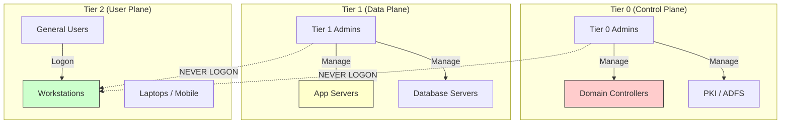

# Identity & Access Management (IAM)

Identity is the control plane.

## 1. Tiered Administration (Red Forest)
Preventing "Credential Theft" from escalating to Domain Dominance.

- **Rule**: A Higher Tier account *never* logs into a Lower Tier asset. If a Domain Admin logs into an infected workstation, their hash is stolen, and the game is over.

## 2. Privileged Access Workstations (PAW)
Admins should not check email or browse the web on the same machine they use to manage the Domain Controller.

### PAW Implementation Specs
1.  **Dedicated Hardware**: A separate physical laptop for admin tasks.
2.  **Clean Source**: Built from clean media, never internet-connected during build.
3.  **Restricted Internet**: Block ALL internet access except specific management endpoints (Azure Portal, etc.).
    - **No Email**: No Outlook. No Browsing.
4.  **IPsec Enforcement**: Domain Controllers should be configured to configured to REJECT RDP connections unless they come from a known PAW IP Address.

## 3. MFA & Conditional Access
- **MFA**: Non-negotiable for external access.
- **Conditional Access**: "If trying to access Email AND User is in USA AND Device is Managed -> ALLOW". "If User is in North Korea -> BLOCK".

## 4. Just-In-Time (JIT) Access
Admins shouldn't have permanent admin rights.
- **Workflow**: Admin requests access to Server X -> Approval -> Temporary Admin rights granted for 4 hours -> Automatic removal.
